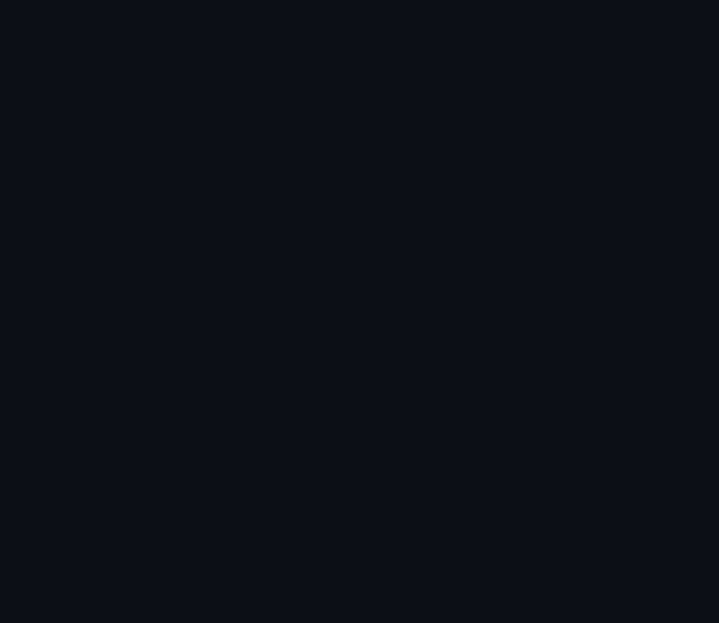

# 🛸 airecon2

**A wifite-style AI recon & pentest console — clone it, launch it, and a menu does the work.**

Pure Python standard library (zero pip installs). One LLM brain — **any of 11
providers or any custom OpenAI-compatible endpoint** — driving 16 recon &
offensive tools, with an optional Kali Docker lab doing the heavy lifting in
the background.

> ⚠️ **Authorized use only.** Offense is allowlist-gated (`AUTHORIZED_TARGETS`)
> and every action is audit-logged. Test only systems you own or have written
> permission to test. See [GUIDE.md](GUIDE.md).



## Launch

```bash
git clone https://github.com/<you>/airecon2 && cd airecon2
./airecon2            # Linux/macOS/Git-Bash   (airecon2.bat on Windows)
```

First run walks you through setup (pick a provider, paste a key, set your
authorized targets), then drops you in the main menu:

```
  +---------------------------------------------------+
  | MAIN MENU                                         |
  +---------------------------------------------------+
  | [1] Recon a target (guided)                       |
  | [2] Pentest a target (guided, offensive tools)    |
  | [3] Free prompt (AI picks the tools)              |
  | [4] Settings (provider, keys, permissions)        |
  | [5] Lab status / start Docker lab                 |
  | [6] Reports & cracked credentials                 |
  | [h] Help                                     [q] Quit
  +---------------------------------------------------+
  or type a command - help for the list

  airecon2 > recon https://your-own-site.example
```

No menus needed if you don't want them — `airecon2 > crack http://mylab/login`
works straight from the prompt. `--help` (or `h`) always gets you un-lost.

## What you get

| | |
|---|---|
| 🧠 **Any LLM** | Gemini · OpenAI · OpenRouter · Groq · Mistral · DeepSeek · Together · xAI · Ollama · LM Studio · **any custom OpenAI-compatible endpoint** — switched from Settings, models auto-discovered from the endpoint, automatic fallback when one model 429s/503s |
| 🔍 **Recon** | headers, methods, pages, robots.txt, misconfig analysis |
| 🗡️ **Pentest** | dirbuster, param fuzzing, XSS/SQLi/command-injection probes, login brute-force |
| 🐧 **Kali lab in Docker** | nmap, sqlmap, hydra, aircrack-ng, tshark, wifite — running in the background, results land on your host |
| 📶 **WiFi / monitor mode** | survey, capture, deauth — via a USB adapter passed into the lab |
| 📄 **Reports** | every run saves a txt report; cracked credentials go to `workspace/credentials.txt` with the path printed |
| 🧾 **Audit trail** | every action timestamped in `workspace/audit.log` |

## Requirements

```bash
pip install -r requirements.txt   # installs nothing - airecon2 is pure stdlib
```

Python 3.12+. Optional: **Docker Desktop** (the pentest lab), **Ollama** (local
LLM), **usbipd-win** (WiFi monitor mode).

## Inside the lab

Heavy tools run inside the Linux container automatically (`use_lab` is wired in).
Shell in manually any time:

```bash
docker exec -it airecon2-lab bash
```

Monitor mode (needs a USB wifi adapter — built-in laptop cards won't do it):

```bash
usbipd wsl attach --busid <id>          # Windows admin prompt
docker exec -it airecon2-lab bash
airmon-ng start wlan0                   # -> wlan0mon
```

## Scripting (headless)

The TUI is the front door, but everything is scriptable — this is also how
AI agents (Freebuff, Claude, your own scripts) drive airecon2:

```bash
python lib/__main__.py --status                    # provider/key/lab health
python lib/__main__.py --list-providers            # all 11 providers + key state
python lib/__main__.py --run "recon https://target" --provider gemini
python lib/__main__.py --run "pentest https://target" --mode pentest --json
python lib/__main__.py --run "scan it" --provider custom   # any OpenAI-compatible endpoint
```

`--json` emits machine-readable output (report + full tool transcript) — parse
it, don't scrape it.

```python
from lib import agent
result = agent.run("Recon https://your-site", provider="gemini")
print(result["report"])
```

## Project layout

```
airecon2/
├── airecon2 / airecon2.bat   launchers
├── lib/                      the whole agent (stdlib only)
│   ├── tui.py                wifite-style console
│   ├── agent.py llm.py config.py tools.py report.py banner.py
│   └── offsec/               offensive tools + allowlist gate + lab exec
├── lab/                      Kali-minimal Docker lab (compose + Dockerfile)
├── GUIDE.md                  full teaching guide - every command & workflow
├── requirements.txt          intentionally empty (stdlib only)
└── workspace/                audit.log, reports/, credentials.txt (gitignored)
```

## License

MIT — [LICENSE](LICENSE).
